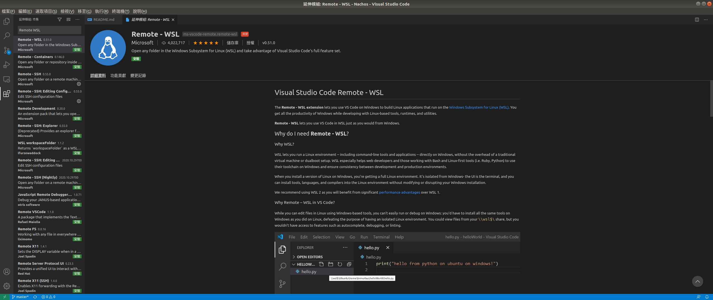
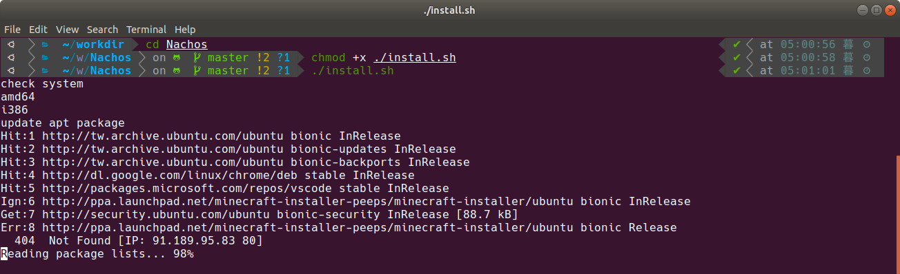
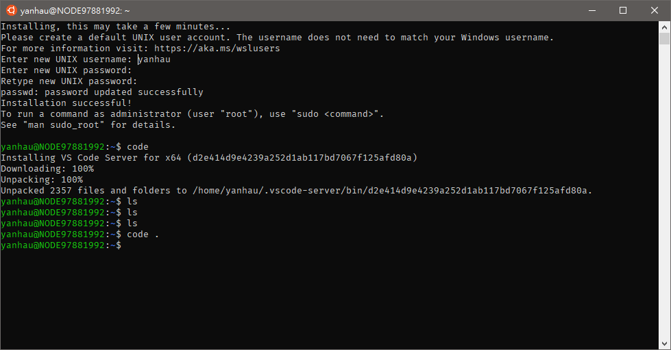
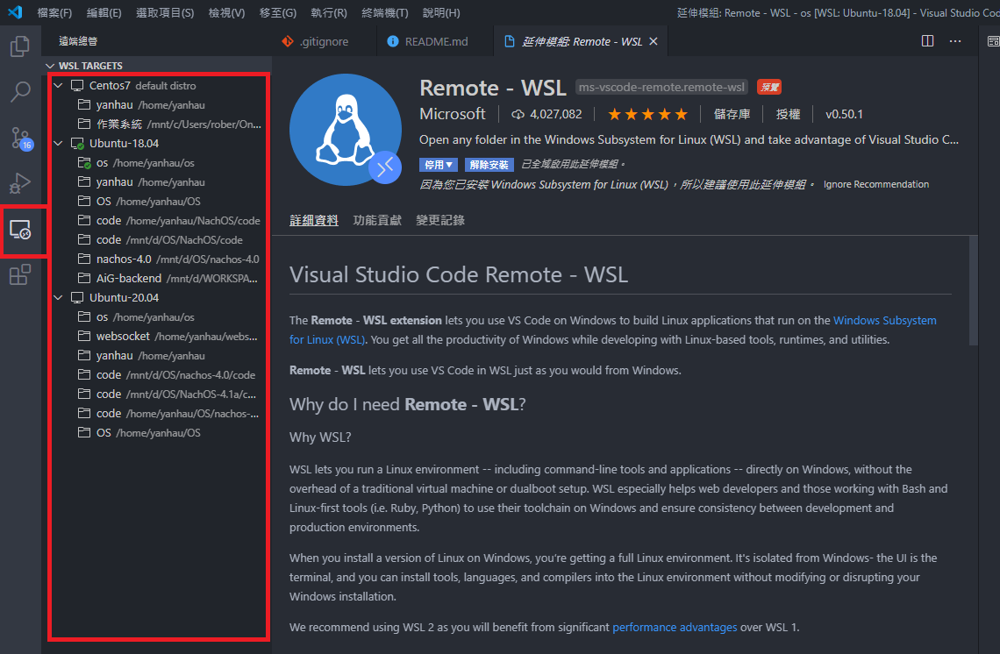
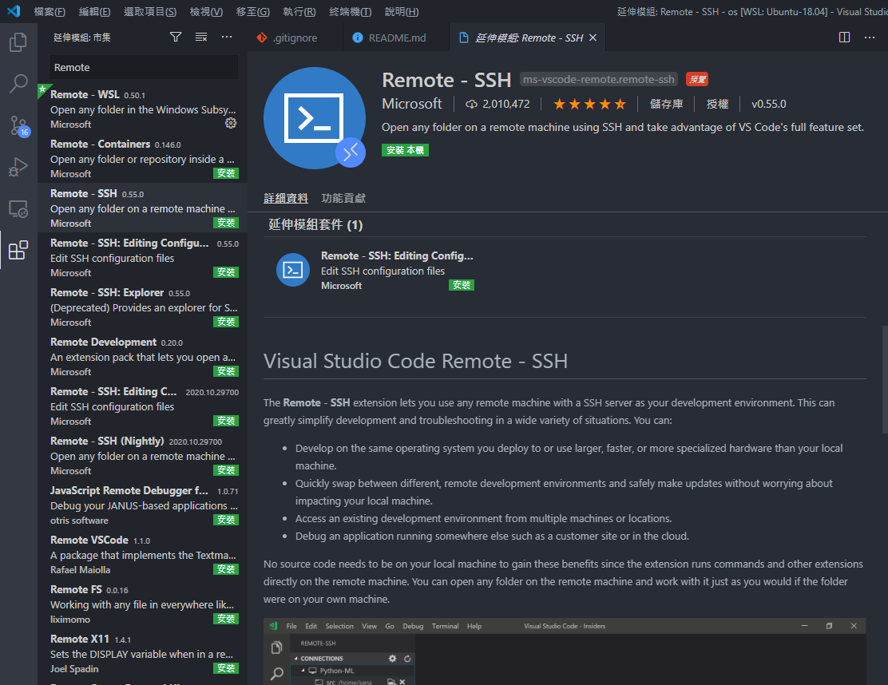
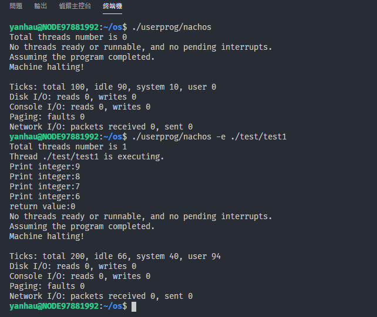
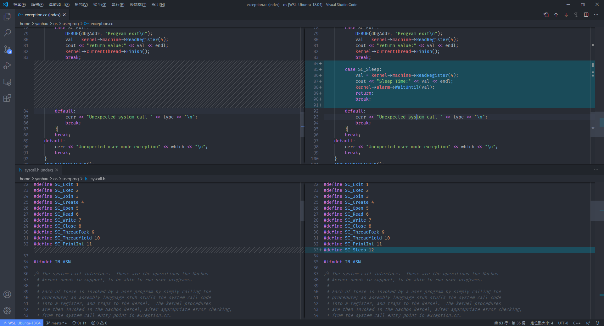
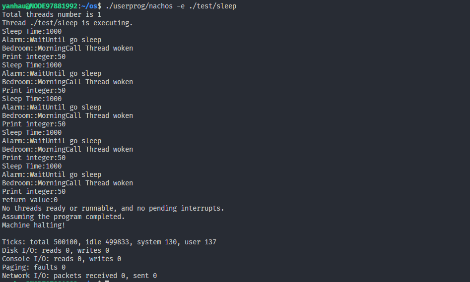
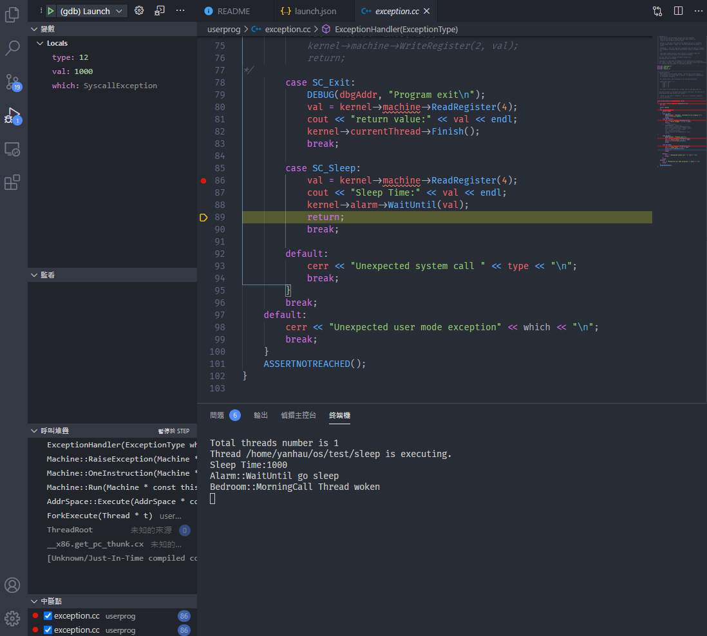

<div style="text-align:center"><h1>Nachos Dev Environment</h1></div>

- [前言](#前言)
- [事前準備](#事前準備)
  - [(For Windows User) WSL install](#for-windows-user-wsl-install)
  - [WSL or Linux (Ubuntu 18.04 LTS)](#wsl-or-linux-ubuntu-1804-lts)
    - [Windows WSL用戶](#windows-wsl用戶)
    - [進入WSL或是在Linux中](#進入wsl或是在linux中)
- [如何起步](#如何起步)
  - [使用原生的 Linux](#使用原生的-linux)
  - [使用 Windows WSL](#使用-windows-wsl)
  - [使用 Virtual Machine (Virtual Box, VMWare, Hyper-V等)](#使用-virtual-machine-virtual-box-vmware-hyper-v等)
- [實作 Sleep](#實作-sleep)
  - [執行結果](#執行結果)
  - [Run Nachos use GDB](#run-nachos-use-gdb)

# 前言
本開發環境基於 NTUST - Nachos4.0 , 以及 [我自己](https://github.com/Yan-Hau/I-dont-Copy-From-The-Internet) , 重新針對 64bit 環境Patch：
- 提供shell script, 降低各開發者針對環境初始化的不同設定衝突
- 透過 GNU Compiler flag 以及 g++ multilib 支援 64 bits 編譯 32 bits的Nachos
- 和 Visual Studio Code 進行整合
- 透過 VSC 擴充, 加強 c++ 的語法提示以及型別整合
- 修改部份 nachos 核心, 使得 c++11 執行可能
- 提供VSC 與 GDB的整合, 可以在 GUI 上運行 gdb 來除錯
- 程式碼耦合性減低

本專案沒有修改核心, 所以適用在原本 NTUST 的 Nachos4.0 上

但是需要進行幾點工作：
- Ubuntu 64bits (建議 Ubuntu 16.04以上), 因為 VSCode 需要在 64bits 客體上運行
- 修改 install.sh: compiler block (把 sudo apt-get install -y g++-multilib g++-multilib 註解)
- 啟用 install.sh 的 support i386 block
- 啟用 install.sh 的 docker block
docker 的運作指令, 寫入在 `package.json` 中供大家參考

如圖所示, 一樣可以使用 VScode 在助教提供的 Nachos4.0 edition 上編寫程式碼, 以下提供測試表格參考

| | Ubuntu 14.04 | Ubuntu 16.04 | Ubuntu 18.04 | Ubuntu 20.04 |
| - | - | - | - | - |
| Nachos4.0(助教版) C++11 support | No | Yes | Yes | Yes |
| Nachos4.0(助教版) VSCode support | No (32bit 不可執行 64bit 的VSC ) | Yes | Yes | Yes |
| Nachos4.0(助教版) VSCode GDB GUI support | No (32bit 不可執行 64bit 的VSC ) | Yes | Yes | Yes |
| Nachos4.0(助教版) Docker support | 不需要 | Unknown | Yes | Yes |
| Nachos4.0(助教版) Origin Compile 32-bit support | 不需要 | Yes | Yes | Yes |


| | Ubuntu 14.04 | Ubuntu 16.04 | Ubuntu 18.04 | Ubuntu 20.04 |
| - | - | - | - | - |
| Nachos4.1(yhc版) C++11 support | No | Yes | Yes | Yes |
| Nachos4.1(yhc版) VSCode support | No (32bit 不可執行 64bit 的VSC ) | Yes | Yes | Yes |
| Nachos4.1(yhc版) VSCode GDB GUI support | No (32bit 不可執行 64bit 的VSC ) | Yes | Yes | Yes |
| Nachos4.1(yhc版) Docker support | 不需要 | Yes | Yes | Yes |
| Nachos4.1(yhc版) Origin Compile 32-bit support | 不需要 | Yes | Yes | Yes |

<div style="font-weight:900">
<br/><br/>
特別注意： 該版本和上課提供的版本一模一樣, 只是針對 x64 system 進行 patch
</div>

# 事前準備
## (For Windows User) WSL install
請以 **管理員身分** 開啟 windows power shell, 輸入以下指令
```shell
$ systeminfo | find "System Type"
$ dism.exe /online /enable-feature /featurename:Microsoft-Windows-Subsystem-Linux /all /norestart
$ dism.exe /online /enable-feature /featurename:VirtualMachinePlatform /all /norestart
```
並且根據系統型別(x64 or arm64), 下載對應的 WSL更新檔

[x64](https://wslstorestorage.blob.core.windows.net/wslblob/wsl_update_x64.msihttps://wslstorestorage.blob.core.windows.net/wslblob/wsl_update_x64.msi)

[arm64](https://wslstorestorage.blob.core.windows.net/wslblob/wsl_update_arm64.msi)

完成後, 在 Power Shell中執行
```shell
$ wsl --set-default-version 2
```
最後, [下載WSL](https://www.microsoft.com/zh-tw/p/ubuntu-1804-lts/9n9tngvndl3q?rtc=1&activetab=pivot:overviewtab)  或是在Windows商店輸入 Ubuntu 18.04 LTS 查詢) 並啟動

下載過程, 可以先在 Visual Studio Code 安裝 Remote WSL 套件, 之後等到WSL下載完成並啟動後, 設定帳號、密碼

## WSL or Linux (Ubuntu 18.04 LTS)

### Windows WSL用戶
可以在 `"開始" -> "Ubuntu"` 開啟 WSL, 或是在 VSCode 的 `RemoteWSL` 套件中開啟(建議)。

請注意, 請進入到 WSL的家目錄( ~/ 或是 /home/[username]) 下, 不要到 windows的目錄( /mnt/* )
因為 windows 目錄對 Virtual Machine 是掛載點 , 會受到一些作業系統的限制


### 進入WSL或是在Linux中
若為設定 git 資訊, 請先設定 git 資訊, 然後才 clone 專案
```shell=
$ git config --global user.name <Your username>
$ git config --global user.email <Your email>
```

把專案 clone 下來後, 在專案根目錄下執行
```shell=
$ chmod +x ./install.sh
$ ./install.sh
```

完成後, 已經完成套件安裝. install.sh中, 包含 docker 與 npm 的下載指令, 若有需要可以使用。

在 64 bits System 上, 已經完成對 32 bit System compiler的支援 , 透過使用 `g++-multilib gcc-multilib` 兩個 library , Ubuntu 16.04 ~ 20.04 的開發者, 已經完成向下編譯的支援

若想直接使用舊版 gcc 編譯, 可以取消 install.sh 中 `support i386` 區塊的註解, 並且自行安裝舊版 g++ 進行後編譯
若有其他考量 , 也可以使用 docker 封裝 i386的 Ubuntu 14.04, 取消 install.sh `docker` 區塊的註解, 然後修改 package.json 的 `<your 'code' path>`, 把自己的 `/code` 資料夾掛載到docker中, 進行編譯即可(專案根目錄已經提供 Dockerfile)

# 如何起步
以下環境, 皆假設在 Linux / WSL 2 中執行

和 [I-dont-Copy-From-The-Internet](https://github.com/Yan-Hau/I-dont-Copy-From-The-Internet)不同, 因為該專案的耦合度較高, 所以針對Makefile做一些調整, 只需要在根目錄執行 `make` , 就會把專案跑起來了

可以簡單分成三種情況：

## 使用原生的 Linux
直接安裝好 VScode 後, 安裝 C/C++ 擴充 (搜尋 ms-vscode.cpptools), 編譯完成後按下 F5, 就可以執行 GDB了
* * *
## 使用 Windows WSL
提供兩種方法：
1. 在 WSL CLI中, 輸入 `code .` , WSL會自行安裝好 VSCode Remote Server
   

2. 在 VSCode中, 安裝好 WSL擴充(ms-vscode-remote.remote-wsl), 選擇對應的資料夾進入即可 
   
   
* * *
## 使用 Virtual Machine (Virtual Box, VMWare, Hyper-V等)
這種情況有兩個方式處理：
1. 參考 [原生的 Linux](#使用原生的-linux) 直接當 Linux 處理

2. 在網卡設定中, 進行自己網卡以及虛擬網卡的橋接, 然後在Linux架設SSH Server
   
  安裝 SSH 擴充功能
   

  點擊右下角的 `><` 標誌, 連線到你的 Linux Server 上
   

# 實作 Sleep

首先證明, 和助教的版本是一樣的



<div style="font-size:3em">然後到網路上, 大膽抄Code</div>

/threads/alarm


/userprog/syscall


## 執行結果


## Run Nachos use GDB

```json
{
    "version": "0.2.0",
    "configurations": [
        {
            "name": "(gdb) Launch",
            "type": "cppdbg",
            "request": "launch",
            "program": "${workspaceFolder}/userprog/nachos",
            "args": ["-e", "${workspaceFolder}/test/sleep"],
            "stopAtEntry": false,
            "cwd": "${workspaceFolder}",
            "environment": [],
            "externalConsole": false,
            "MIMode": "gdb",
            "setupCommands": [
                {
                    "description": "enable gdb beautiful display",
                    "text": "-enable-pretty-printing",
                    "ignoreFailures": true
                }
            ]
        }
    ]
}
```
成功抓到System Call 中斷點
